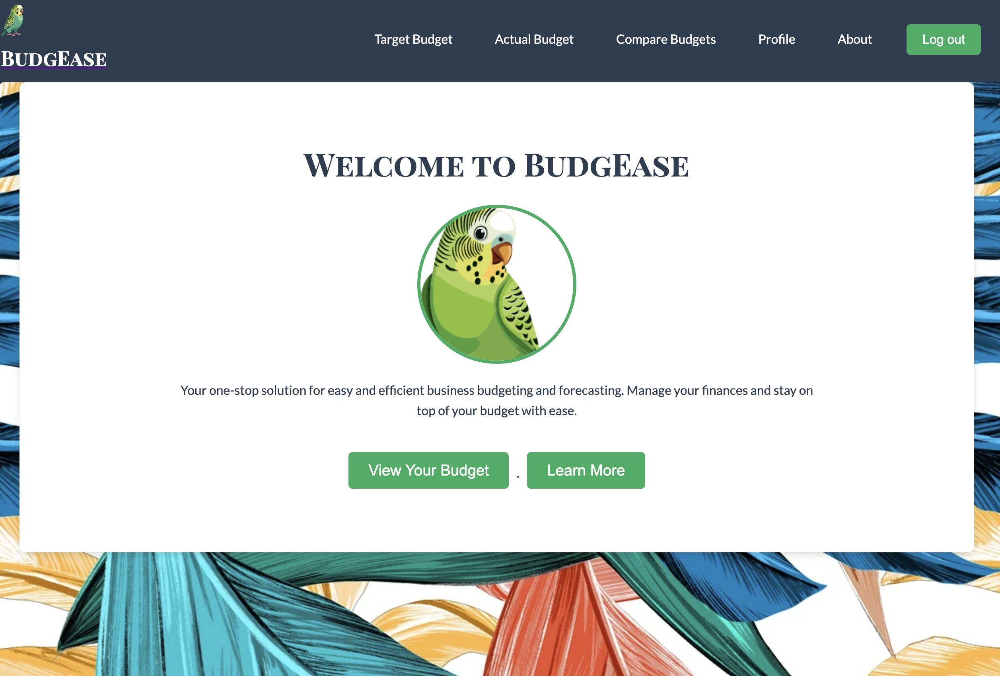
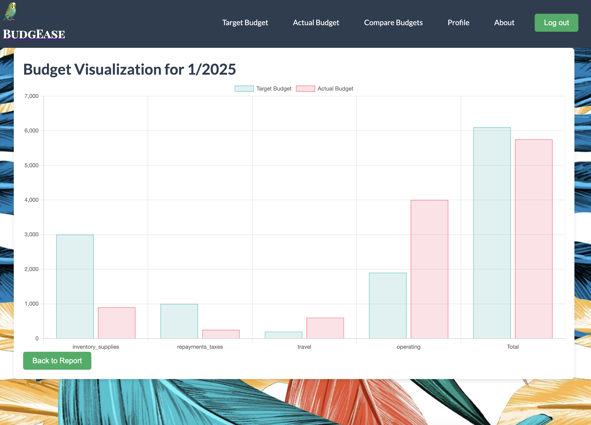

# 🦜 BudgeEase
*A smart and simple budgeting tool for small businesses*

***BudgEase*** is a tool designed to help businesses track their finances, manage monthly expenses, and achieve financial goals. ***BudgEase*** is a simple, intuitive platform that allows the user to clearly view their target budget goals, their actual recorded budget, and then see the variance between the two.  ***BudgEase*** even has a data visualization feature to show the user a clear visual of their monthly variance in budget.

BudgEase was inspired by the real-life need for entrepreneurs and business owners—especially those running smaller or growing companies—to easily and clearly monitor their spending vs. budget goals.  

BudgEase gives you insight into your business's financial health in real time.

## Getting Started

[Deployed BudgEase App](https://budgease-budgeting-app-9ca6cd57c6c3.herokuapp.com/) 

[Trello Board for Project Planning](https://trello.com/b/sR5IxMzA/budgee-a-business-forecasting-and-budgeting-application)

## Attributions

- Background Image from [Pixabay](https://pixabay.com/illustrations/leaves-tropical-exotic-green-plant-3923413/)
- Logo Art from Adobe AI Graphic Designer
- Javascript Fetch snippets inspired by [MDN Web Docs](https://developer.mozilla.org/en-US/)
- Chart.js snippets inspired by [TestDriven.io](https://testdriven.io/blog/django-charts/) & [Chart.js](https://www.chartjs.org/docs/latest/getting-started/)
- [Django Docs](https://docs.djangoproject.com/en/5.2/) for many questions along the way
- Google Fonts: *Fugaz One*, *Lato*, *Playfair Display SC*

## Technologies Used

- **Python**
- **Django** 
- **HTML/CSS**
- **Javascript (& Chart.js)**
- **PostgreSQL**
- **Heroku**

## Current Features

- User Authentication
- Target vs. Actual Monthly Budget Tracking
- Month & Year filtering
- Add, Edit, and Delete budget entries
- Comparison Report & Visualizations
- Responsive styling & custom branding

## Next Steps/Stretch Goals

- Tagging individual items to make the database searchable by any tag a user chooses to apply to many items
- Mobile access to the application for easy and fast additions of actual budget items
- Team accounts with multi-user capability
- Better connection and tracking with monthly income tools like Quickbooks
- Email reminders for monthly entries

> Made by Halsey Swetzoff  
> BudgEase © 2025
